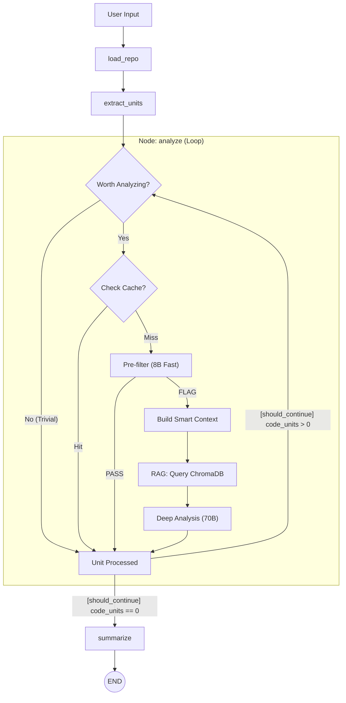

# System Architecture

## Overview

The Green Code Analyzer is designed as a pipeline-based system orchestrated by [LangGraph](https://github.com/langchain-ai/langgraph). 
High-Level Data Flow:



## Workflow Orchestration

The core logic resides in `app/graph.py`, which defines a state machine for the analysis process.

### The Graph State

The state is managed by the `GraphState` Pydantic model, which flows between nodes:

| Field | Type | Description |
|-------|------|-------------|
| `files` | `List[str]` | List of file paths to process. |
| `code_units` | `List[CodeUnit]` | All extracted functions/classes pending analysis. |
| `current_unit` | `CodeUnit` | The specific unit currently being processed. |
| `findings` | `List[Finding]` | Accumulated issues detected by the LLM. |
| `symbol_table` | `SymbolTable` | Index of all project functions for context resolution. |
| `analysis_mode` | `str` | `suggestion` (patches) or `detection` (issues only). |
| `input_type` | `str` | Source type: `path`, `repo`, or `code`. |
| `code_content` | `str` | Raw content if `input_type` is `code`. |

### Nodes

1.  **`load_repo`**:
    *   Scans the directory structure.
    *   Filters out ignored directories (`.git`, `node_modules`, `venv`).
    *   Identifies supported file extensions definitions in `repo_loader.py`.
    *   Or handles single file/snippet inputs.

2.  **`extract_units`**:
    *   Parses each file using language-specific parsers (`ASTParser` factory).
    *   Splits files into discrete `CodeUnit` objects (functions, classes).
    *   **Builds Symbol Table**: Registers every unit for global context resolution.
    *   **Prioritization**: Sorts units by Cyclomatic Complexity (highest first).

3.  **`analyze`** (The Loop):
    *   Iterates through `code_units` one by one.
    *   **Smart Filter**: Checks if the unit is "worth analyzing" (Complexity >= 3, LOC >= 15, or suspicious tags).
    *   **Cache Check**: Computes MD5 hash of function content to skip re-analysis.
    *   **Pre-filter (Tier 1)**: Sends the unit to a fast 8B model for quick screening. Units that `PASS` are skipped. Units that are `FLAG`-ged proceed to deep analysis.
    *   **Context Injection**: Resolves dependencies via `SymbolTable` (including Import Resolution and Class Context) to build rich prompts.
    *   **RAG Retrieval**: Queries the ChromaDB vector store for semantically similar before/after code examples. Up to 2 matching examples are formatted and injected into the prompt (see [RAG Examples](RAG_EXAMPLES.md)).
    *   **Taxonomy Detection**: Matches suspicious tags and code patterns against the taxonomy hierarchy to determine a compact set of valid categories for the LLM.
    *   **Deep Analysis (Tier 2)**: Sends the full prompt (code + context + examples + taxonomy) to the deep 70B model.
    *   **Result Parsing**: Decodes JSON response, validates taxonomy category, and appends to `findings`.

4.  **`summarize`**:
    *   Terminal node. Currently a placeholder for future aggregation or report generation logic.

## Data Models

### CodeUnit (`app/ast_parser.py`)
Represents the atomic unit of analysis (usually a function).
*   `code`: The raw source code.
*   `complexity`: Calculated Cyclomatic Complexity score.
*   `suspicious_tags`: List of tags like `IO`, `LOOP`, `DB`.
*   `dependencies`: List of function calls made by this unit.
*   `imports`: Local import mapping for resolution.
*   `parent_name`: Name of the parent class (for methods).

### Finding (`app/models.py`)
Represents a detected inefficiency.
*   `file`: File path.
*   `function_name`: Name of the function.
*   `start_line` / `end_line`: Precise location.
*   `complexity`: The complexity score of the affected function.
*   `issue`: Short title of the problem.
*   `explanation`: Detailed reasoning of *why* it wastes energy.
*   `patch`: Proposed code fix (Unified Diff format).
*   `problematic_code`: The specific code snippet triggering the issue.
*   `taxonomy_category`: Full taxonomy category ID (e.g., `data_layer.efficient_access.batch_operations`).
*   `similar_to_example`: ID of a matched RAG example, if the issue resembles one.

## Caching Strategy

To ensure speed and efficiency, the system uses a granular, function-level cache (`app/cache.py`).

**Key Concept**: We do not cache by file; we cache by **function content**.

1.  **Hash Generation**:
    ```python
    hash = md5(function_code_content)
    key = f"{file_path}:{function_name}:{hash}:{analysis_mode}"
    ```
2.  **Behavior**:
    *   If you change Function A but leave Function B touched in the same file, Function B will still hit the cache.
    *   The `analysis_mode` is part of the key, so "Detection" runs don't pollute "Suggestion" cache entries.
3.  **Storage**:
    *   Persisted to `.llm_analysis_cache.json` in the root directory.

## RAG Example Store

The system includes a vector-based example store (`app/example_store.py`) that enables Retrieval-Augmented Generation. Before/after code examples are stored as JSON files in `examples/` (organized by taxonomy category), loaded into a ChromaDB collection at startup, and embedded using `all-MiniLM-L6-v2` from Sentence-Transformers.

During analysis, the store is queried with the code unit being analyzed to find semantically similar examples. These are formatted and injected into the LLM prompt, giving the model concrete optimization patterns to reference. See [RAG Examples](RAG_EXAMPLES.md) for full details.

Controlled via `GREENCODE_RAG` environment variable (enabled by default).

## Taxonomy

The taxonomy (`app/taxonomy.py`) defines a hierarchical classification of energy-efficient coding practices across 7 top categories (Data Layer, Network Layer, Background Tasks, User Interface, Server-Side, Control Flow, Build Pipeline). Leaf nodes include `detection_hints` for automatic category suggestion based on code patterns. The LLM is provided with a compact taxonomy representation (~135 tokens) and must classify each finding into a valid category.

## Web Server

The `server.py` is a Flask application that wraps the analysis graph. It uses `Flask-SocketIO` to stream real-time progress updates to the frontend as the graph transitions between nodes.
