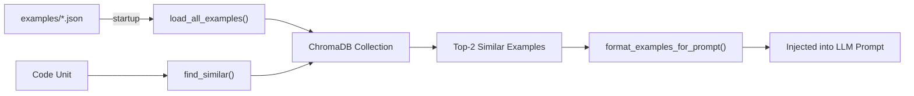

# RAG Example Retrieval System

## Overview

The Green Code Analyzer uses **Retrieval-Augmented Generation (RAG)** to enhance LLM analysis with real-world before/after code optimization examples. When analyzing a code unit, the system retrieves semantically similar examples from a vector store and injects them into the prompt. This grounds the LLM's analysis in concrete, proven patterns rather than relying solely on its training knowledge.

## Architecture



## Components

### ExampleStore (`app/example_store.py`)

A ChromaDB-backed vector store that manages the lifecycle of code examples:

| Method | Description |
|--------|-------------|
| `__init__(persist_dir, use_embeddings)` | Initializes with ChromaDB persistent storage and optional sentence-transformer embeddings |
| `load_all_examples(examples_dir)` | Recursively loads all `.json` files from the examples directory |
| `add_example(example)` | Adds or updates a single example in the vector store |
| `find_similar(code, n_results, category_filter)` | Queries the store for semantically similar examples |
| `format_examples_for_prompt(examples)` | Formats retrieved examples into prompt-ready text |


### Embedding Model

The store uses **`all-MiniLM-L6-v2`** from Sentence-Transformers for semantic embeddings. This model maps code and descriptions into a 384-dimensional vector space, enabling cosine similarity search.

If `sentence-transformers` is not installed, ChromaDB's default embedding function is used as a fallback.

### Vector Indexing

Each example is indexed with:
- **Document**: Concatenation of `title + description + before.code` (used for embedding and similarity search)
- **Metadata**: `taxonomy_id`, `title`, `key_insight`, `energy_impact`, `language`, `source`
- **ID**: The example's unique `id` field

The full `before` and `after` code are stored in an in-memory cache for retrieval after matching.

## Example JSON Format

Examples are stored as JSON files in the `examples/` directory. Each JSON file follows this structure:

```json
{
    "id": "n_plus_one_to_join",
    "taxonomy_id": "data_layer.efficient_access.batch_operations",
    "title": "Replace N+1 Queries with Single JOIN Query",
    "description": "Instead of fetching data in a loop (N+1 pattern), use a single query with JOINs",
    "language": "python",
    "source": "erpnext/reorder_item.py",
    "before": {
        "code": "# The inefficient code...",
        "lines": 28
    },
    "after": {
        "code": "# The optimized code...",
        "lines": 35
    },
    "energy_impact": "Reduces database round-trips from O(N) to O(1).",
    "key_insight": "Use Query Builder with JOINs to fetch related data in a single query."
}
```

| Field | Required | Description |
|-------|----------|-------------|
| `id` |  Unique identifier for the example |
| `taxonomy_id` | Full taxonomy category ID (e.g., `data_layer.efficient_access.batch_operations`) |
| `title` | Human-readable title |
| `description`  | Explanation of the inefficiency pattern |
| `language` | Programming language |
| `source` | Origin of the example (project/file) |
| `before` | Object with `code` (inefficient version) and `lines` count |
| `after` | Object with `code` (optimized version) and `lines` count |
| `energy_impact` | Description of the energy/performance improvement |
| `key_insight` | Core takeaway that the LLM should learn from |

## Retrieval Flow

During analysis of each code unit, the following happens (in `app/graph.py`):

1. **Category Detection**: `detect_likely_categories()` scans the unit's suspicious tags and code for taxonomy `detection_hints` to identify likely categories.

2. **Similarity Search**: `example_store.find_similar(unit.code, n_results=2)` embeds the code unit and queries ChromaDB for the 2 most similar examples using cosine distance.

3. **Formatting**: `format_examples_for_prompt()` structures the retrieved examples into the prompt, showing:
   - Example ID, title, and taxonomy category
   - Before (inefficient) and after (optimized) code
   - Key insight and energy impact
   - Instruction to set `similar_to_example` if a similar pattern is found

4. **Prompt Injection**: The formatted examples are placed in the `{examples_section}` placeholder of the `ENERGY_ANALYSIS_WITH_EXAMPLES` prompt template, alongside the taxonomy categories, dependencies, and target code.

5. **Response Handling**: If the LLM finds an issue similar to a retrieved example, it sets `similar_to_example` to the example's ID. This is stored in the `Finding` model.

## Adding New Examples

1. Create a JSON file following the schema above
2. Place it in the appropriate `examples/<category>/` subdirectory
3. Use a unique `id` and a valid `taxonomy_id` from the taxonomy
4. The example will be automatically loaded on next startup


